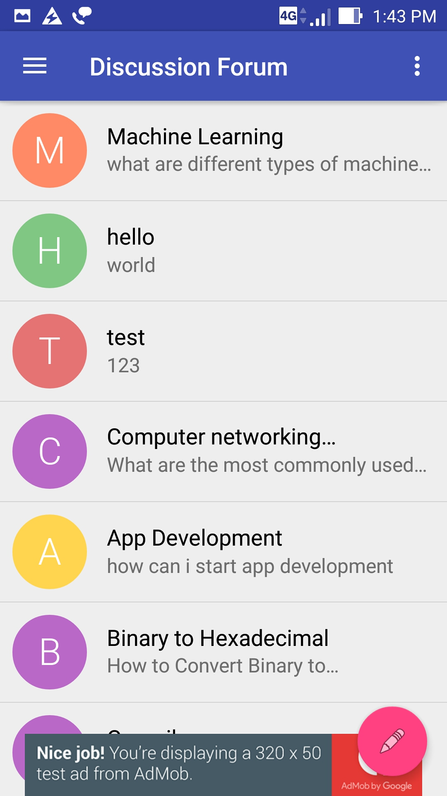
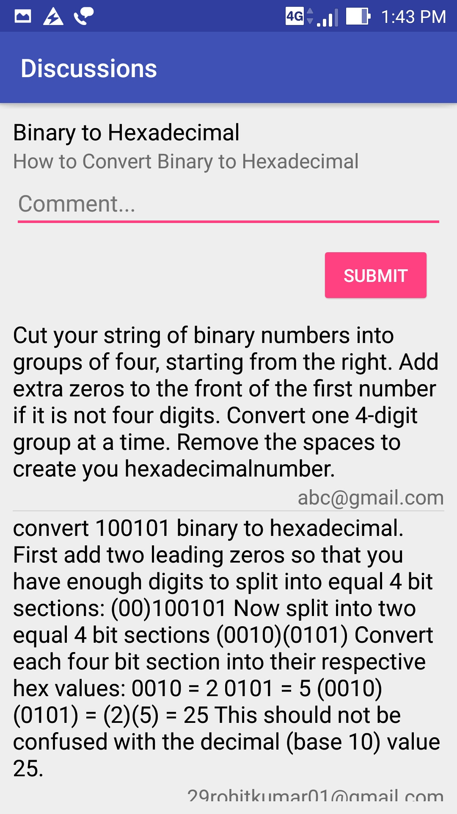
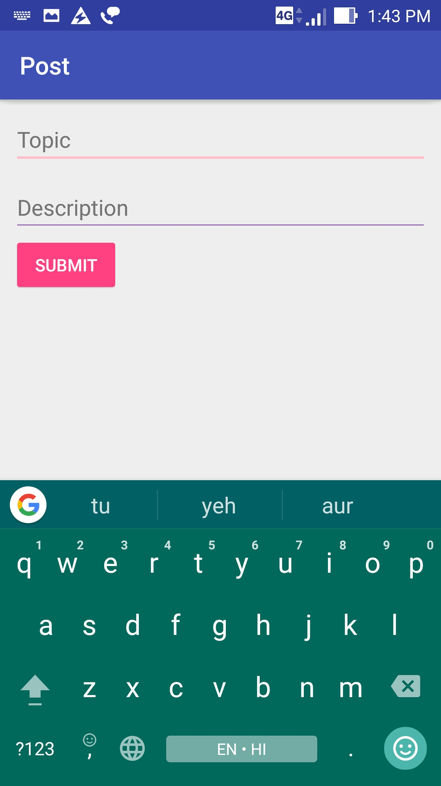
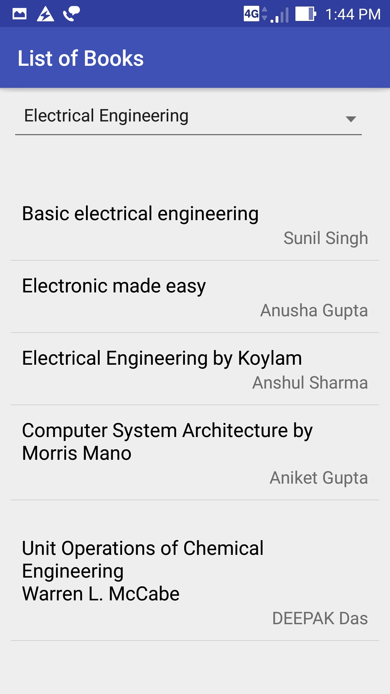
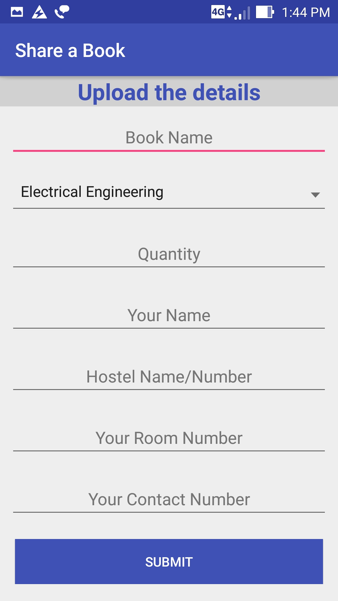
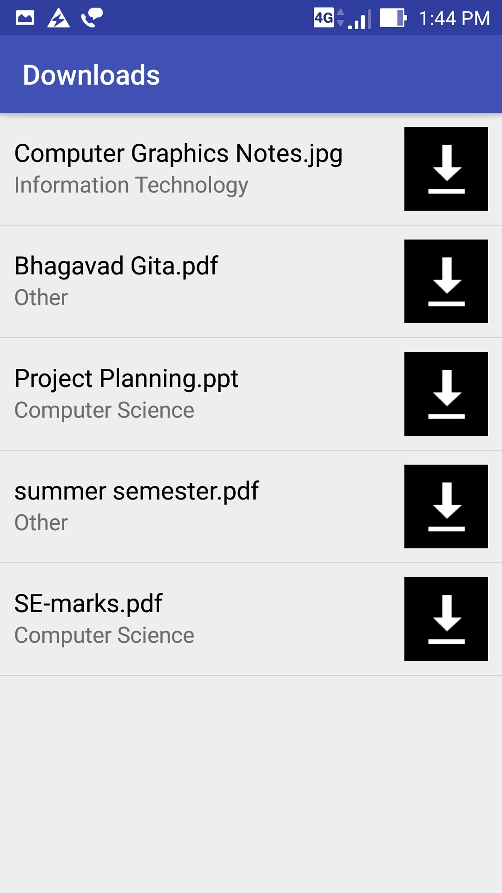
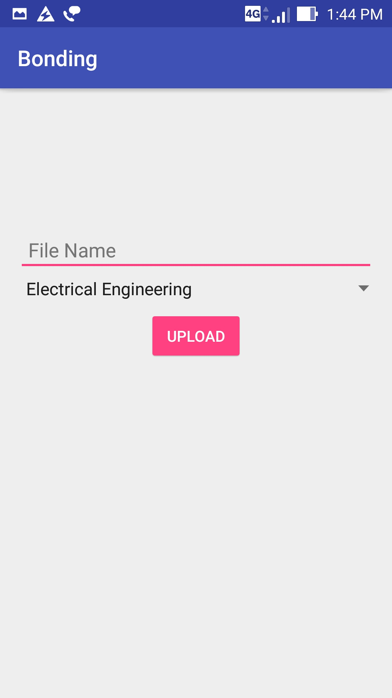
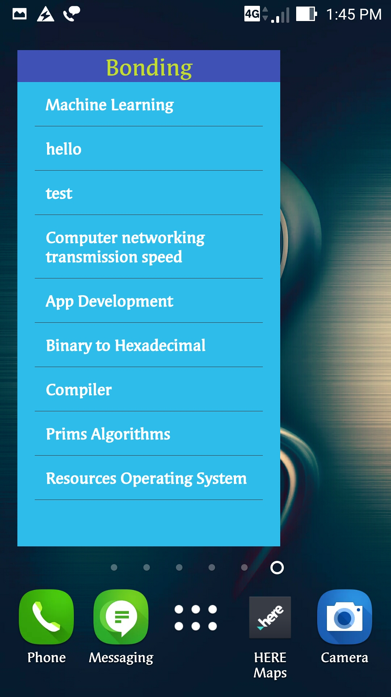

# Capstone-Project-Bonding
Udacity Android Nanodegree Capstone Project

# Introduction

The main motivation for this project comes from a lack of a proper resources sharing mechanism in colleges. Students has a hard time penetrating the wall of surfing on google with multiple files or with a lot of reflective reference materials but still they are not able to get the proper documents they need to have. They waste a lot of their time in searching the material and ends up with the files that are either improper or not serving the purpose .These things matters a lot during the examinations , where you have to handle all of your academic work and keep up the pace. Surely in these cases someone who has the proper knowledge like batch mate or senior could be of great help but you cannot always disturb others for these academics resources .It is necessary then to have a system that works in achieving the goal of resource sharing for a longer period of time at a single platform with good accuracy and not a lot of rushing is required.

The prime objective of this android application software is to create a full-fledged environment which would be a miniature of our college academics activities. It acts as an overview about the various resources that students have with them and wants to share them. User can upload the files and important documents according to the category provided. Also the app provide a real-time discussion forum where multiple user can interact with others and ask any question related to the subjects or any other general technical issue they are not able to resolve. The user can not only share the digital documents but can also provide the information about the various non-digital resources that he/she have with them(i.e Books/Notes) .Later the other user can look up for the information and can contact the person .In order to get all these facilities user must first go through the sign up procedure so that authenticity of the data is maintained.

# Features

- Discussion Forum 
- Download/Upload Content
- Share Information
- User Authentication
- Widget

# Backend

- Google Firebase Database and Storage

# Google Play Services

- AdMob
- Analytics

# Screenshots

  

 

 

  

